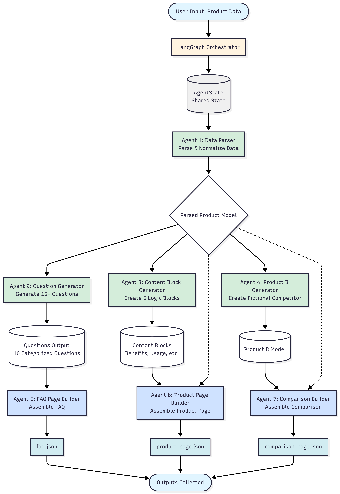

# Multi-Agent Content Generation System
## Project Documentation

---

## Table of Contents

1. [Problem Statement](#problem-statement)
2. [Solution Overview](#solution-overview)
3. [Scopes & Assumptions](#scopes--assumptions)
4. [System Design](#system-design)
5. [Architecture Diagrams](#architecture-diagrams)
6. [Technical Implementation](#technical-implementation)
7. [Agent Specifications](#agent-specifications)

---

## Problem Statement

### Objective

Design and implement a **modular agentic automation system** that takes a small product dataset and automatically generates structured, machine-readable content pages.

### Core Requirements

The system must demonstrate:

1. **Multi-agent workflows** with clear boundaries and single responsibilities
2. **Automation graphs** using directed acyclic graph (DAG) orchestration
3. **Reusable content logic** through composable transformation blocks
4. **Template-based generation** with structured definitions and validation
5. **Structured JSON output** that is machine-readable and well-formed
6. **System abstraction** with proper documentation and extensibility

### Input Specification

**Single Product Dataset** (8 fields):
```json
{
  "name": "GlowBoost Vitamin C Serum",
  "concentration": "10% Vitamin C",
  "skin_type": "Oily, Combination",
  "key_ingredients": "Vitamin C, Hyaluronic Acid",
  "benefits": "Brightening, Fades dark spots",
  "how_to_use": "Apply 2–3 drops in the morning before sunscreen",
  "side_effects": "Mild tingling for sensitive skin",
  "price": "₹699"
}
```

### Output Specification

**Three Machine-Readable JSON Files**:

1. **faq.json** - Minimum 5 Q&A pairs, categorized by topic
2. **product_page.json** - Complete product page with all sections
3. **comparison_page.json** - Product A vs fictional Product B comparison

### Constraints

- No external research or data fetching
- No fact invention beyond input data
- Must use agentic system (not a monolithic script)
- All content derived from provided product data
- Fictional Product B allowed for comparison

---

## Solution Overview

### High-Level Approach

This system implements a **production-grade multi-agent architecture** using **LangChain** and **LangGraph** to orchestrate specialized agents that transform raw product data into structured content pages.

### Core Innovation

The solution employs **structured outputs with Pydantic models** to ensure type safety, automatic validation, and maintainable code throughout the pipeline.

### Technology Stack

| Component | Technology | Purpose |
|-----------|-----------|---------|
| Orchestration | LangGraph 0.2.58 | DAG-based workflow management |
| LLM Framework | LangChain 0.3.13 | Agent integration and prompting |
| Language Model | Ollama 3.3 70b versatile | Content generation with structured output |
| Validation | Pydantic 2.10.5 | Type-safe data models |
| Language | Python 3.10+ | Core implementation |

### Key Features

1. **7 Specialized Agents** - Each with single responsibility and clear boundaries
2. **Structured LLM Outputs** - Pydantic models ensure type safety and validation
3. **Parallel Execution** - Independent agents run concurrently for efficiency
4. **Reusable Content Blocks** - 5 composable transformation functions
5. **Type-Safe State** - Immutable state flow with comprehensive logging
6. **Extensible Design** - Easy to add agents, blocks, or templates

---

## Scopes & Assumptions

### In Scope

**Data Processing**
- Parse and normalize raw product data
- Validate input fields
- Generate unique identifiers

**Content Generation**
- Generate 15+ categorized user questions
- Create 5 reusable content logic blocks
- Generate fictional competitor product (Product B)

**Page Assembly**
- Build FAQ page with minimum 5 Q&As
- Build complete product page with all sections
- Build comparison page analyzing two products

**Output Generation**
- Machine-readable JSON format
- Proper metadata and timestamps
- Structured, validated data

**System Quality**
- Autonomous agent execution
- Comprehensive logging
- Error handling and recovery
- Type safety with Pydantic

### Out of Scope

**External Data**
- Web scraping or API calls
- Database persistence
- External fact checking

**User Interface**
- Web UI or mobile app
- Real-time user interaction
- Visual design implementation

### Assumptions

1. **Single Product Processing**: System processes one product at a time
2. **API Access**: Valid Anthropic API key available
3. **Data Quality**: Input data is well-formed and complete
4. **Output Format**: JSON is the required output format
5. **Language**: All content generated in English
6. **Execution Environment**: Python 3.10+ with required dependencies
7. **Fictional Content**: Product B generation is acceptable
8. **No External Facts**: All content derived from input data only

---

## System Design

### Architecture Overview

The system follows a **layered architecture** with clear separation of concerns:

```
┌─────────────────────────────────────────────────────────────┐
│                    USER INTERFACE LAYER                     │
│              (CLI - Command Line Interface)                 │
└─────────────────────────────────────────────────────────────┘
                            ↓
┌─────────────────────────────────────────────────────────────┐
│                  ORCHESTRATION LAYER                        │
│                   (LangGraph Workflow)                      │
│  • State Management (AgentState)                            │
│  • Workflow Execution (DAG)                                 │
│  • Parallel Branch Management                               |
└─────────────────────────────────────────────────────────────┘
                            ↓
┌─────────────────────────────────────────────────────────────┐
│                      AGENT LAYER                            │
│                   (7 Specialized Agents)                    │
│                                                             │
│  ┌──────────────┐  ┌──────────────┐  ┌──────────────┐       │
│  │   Agent 1    │  │   Agent 2    │  │   Agent 3    │       │
│  │ Data Parser  │  │  Question    │  │Content Block │       │
│  │              │  │  Generator   │  │  Generator   │       │
│  └──────────────┘  └──────────────┘  └──────────────┘       │
│                                                             │
│  ┌──────────────┐  ┌──────────────┐  ┌──────────────┐       │
│  │   Agent 4    │  │   Agent 5    │  │   Agent 6    │       │
│  │ Product B    │  │  FAQ Page    │  │Product Page  │       │
│  │  Generator   │  │   Builder    │  │   Builder    │       │
│  └──────────────┘  └──────────────┘  └──────────────┘       │
│                                                             │
│  ┌──────────────┐                                           │
│  │   Agent 7    │                                           │
│  │ Comparison   │                                           │
│  │ Page Builder │                                           │
│  └──────────────┘                                           │
└─────────────────────────────────────────────────────────────┘
                            ↓
┌─────────────────────────────────────────────────────────────┐
│                    DATA MODEL LAYER                         │
│              (Pydantic Models for Validation)               │
│  • ProductModel                                             │
│  • QuestionsOutput                                          │
│  • ContentBlocks                                            │
│  • FAQPage, ProductPage, ComparisonPage                     │
└─────────────────────────────────────────────────────────────┘
                            ↓
┌─────────────────────────────────────────────────────────────┐
│                    LLM INTEGRATION LAYER                    │
│              (Groq ollama 3.3 20b via LangChain)            │
│  • Structured Output Generation                             │
│  • Prompt Management                                        │
│  • Response Parsing                                         │
└─────────────────────────────────────────────────────────────┘
                            ↓
┌─────────────────────────────────────────────────────────────┐
│                    OUTPUT LAYER                             │
│              (File System - JSON Files)                     │
│     faq.json  │  product_page.json  │  comparison.json      │
└─────────────────────────────────────────────────────────────┘
```

### Component Interaction Flow

```
[User] → [Orchestrator] → [State] → [Agents] → [LLM] → [Validation] → [Output]
```

1. **User** provides product data and triggers
2. **Orchestrator** initializes state and workflow graph
3. **State** maintains shared data across all agents
4. **Agents** process data sequentially and in parallel
5. **LLM** generates structured content via Claude Sonnet 4
6. **Validation** ensures output matches Pydantic schemas
7. **Output** writes validated JSON files to disk

---

## Architecture Diagrams

### System Architecture Diagram

```
                         ┌─────────────────┐
                         │  Product Data   │
                         │     (Input)     │
                         └────────┬────────┘
                                  │
                                  ▼
                    ┌─────────────────────────┐
                    │  LangGraph Orchestrator │
                    │  • Initialize State     │
                    │  • Build Workflow DAG   │
                    │  • Manage Execution     │
                    └─────────────────────────┘
                                  │
                    ┌─────────────┼─────────────┐
                    │             │             │
                    ▼             ▼             ▼
          ┌─────────────┐ ┌─────────────┐ ┌─────────────┐
          │   Phase 1   │ │   Phase 2   │ │   Phase 3   │
          │  Parsing    │ │ Generation  │ │  Assembly   │
          └─────────────┘ └─────────────┘ └─────────────┘
                    │             │             │
                    │   ┌─────────┼─────────┐   │
                    │   │         │         │   │
                    ▼   ▼         ▼         ▼   ▼
              ┌────────────────────────────────────┐
              │         Agent Layer                │
              │  • Data Parser Agent               │
              │  • Question Generator Agent        │
              │  • Content Block Generator Agent   │
              │  • Product B Generator Agent       │
              │  • FAQ Page Builder Agent          │
              │  • Product Page Builder Agent      │
              │  • Comparison Page Builder Agent   │
              └────────────────────────────────────┘
                                  │
                    ┌─────────────┼─────────────┐
                    │             │             │
                    ▼             ▼             ▼
              ┌──────────┐  ┌──────────┐  ┌──────────┐
              │faq.json  │  │product   │  │comparison│
              │          │  │_page.json│  │.json     │
              └──────────┘  └──────────┘  └──────────┘
```

### Workflow Execution Graph (DAG)




### Data Flow Diagram

```
┌─────────────────────────────────────────────────────────────┐
│                        Raw Input                            │
│  {name, concentration, skin_type, ingredients, ...}         │
└─────────────────────────┬───────────────────────────────────┘
                          │
                          ▼
              ┌───────────────────────┐
              │  Data Parser Agent    │
              │  • Validate fields    │
              │  • Normalize format   │
              │  • Generate ID        │
              └───────────┬───────────┘
                          │
                          ▼
              ┌───────────────────────┐
              │   ProductModel        │
              │   (Validated)         │
              └───────────┬───────────┘
                          │
         ┌────────────────┼────────────────┐
         │                │                │
         ▼                ▼                ▼
┌────────────────┐┌────────────────┐┌────────────────┐
│ Questions      ││ Content Blocks ││ Product B      │
│ (15+)          ││ (5 blocks)     ││ (Fictional)    │
└────────┬───────┘└────────┬───────┘└────────┬───────┘
         │                 │                 │
         ▼                 ▼                 ▼
┌────────────────┐┌────────────────┐┌────────────────┐
│ FAQ Builder    ││ Product Page   ││ Comparison     │
│                ││ Builder        ││ Builder        │
└────────┬───────┘└────────┬───────┘└────────┬───────┘
         │                 │                 │
         ▼                 ▼                 ▼
┌────────────────┐┌────────────────┐┌────────────────┐
│ faq.json       ││product_page    ││comparison.json │
│                ││.json           ││                │
└────────────────┘└────────────────┘└────────────────┘
```

---

## Technical Implementation

### Technology Choices & Rationale

#### 1. LangGraph for Orchestration

**Why LangGraph?**
- Purpose-built for multi-agent workflows
- Native DAG support with automatic dependency resolution
- Built-in state management with type safety
- Easy visualization and debugging
- Supports parallel execution natively
- Integrates seamlessly with LangChain

**Alternative Considered**: Custom orchestrator with asyncio
**Decision**: LangGraph provides better abstractions and is production-tested

#### 2. Pydantic for Data Validation

**Why Pydantic?**
- Industry-standard for Python data validation
- Type safety with minimal overhead
- Automatic validation and serialization
- Excellent error messages
- IDE support with autocomplete
- Native integration with LangChain structured output

**Alternative Considered**: dataclasses, attrs
**Decision**: Pydantic provides comprehensive validation out-of-the-box

#### 3. Python as Implementation Language

**Why Python 3.10+?**
- LangChain and LangGraph are Python-native
- Excellent AI/ML ecosystem
- Type hints for better code quality
- Rich standard library
- Wide adoption and community support

**Alternative Considered**: TypeScript, Java
**Decision**: Python is the standard for AI agent systems

### Project Structure

```
kasparro-ai-agentic-content-generation-system-nirujogi-prudhvi/
│
├── main.py                          # Core system implementation
│   ├── Orchestrator Class
│   └── Main Execution Function
│
├── requirements.txt                 # Dependencies
│   ├── langchain==0.3.13
│   ├── langchain-core==0.3.28
│   ├── langchain-groq==0.3.3
│   ├── langgraph==0.2.58
│   ├── pydantic==2.10.5
│   └── python-dotenv==1.0.1
│
├── Agents                        # Agent Classes (7 agents)
│   └── comparison_page.py
|   └── content_block.py
|   └── data_parser.py
|   └── faq_page.py
|   └── product_page.py
|   └── productb_generator.py
|   └── question_generator.py
│
├── .env                          # Environment variables (not in repo)
│   └── GROQ_API_KEY=your_api_key_here
│
├── .gitignore                      # Git ignore rules
│
├── model                           # Pydantic Models (15+ models)
|   └── schema.py
│
├── state.py                        # Agent State\
│
├── docs/
│   └── projectdocumentation.md     # This file
│
└── outputs/                        # Generated JSON files
    ├── faq.json
    ├── product_page.json
    └── comparison_page.json
```

---

## Agent Specifications

### Agent 1: Data Parser Agent

**Responsibility**: Parse and normalize raw product data into structured internal model

**Input**:
```python
raw_product_data: Dict[str, Any]  # Raw product dictionary
```

**Output**:
```python
ProductModel:  # Validated Pydantic model
    - name: str
    - category: str
    - concentration: str
    - skin_types: List[str]
    - ingredients: List[str]
    - benefits: List[str]
    - how_to_use: str
    - side_effects: str
    - price: str
```

**LLM Integration**:
```python
self.structured_llm = llm.with_structured_output(ProductModel)
product: ProductModel = self.structured_llm.invoke(prompt)
```

---

### Agent 2: Question Generator Agent

**Responsibility**: Generate minimum 15 categorized user questions

**Input**:
```python
product_model: Dict[str, Any]  # Parsed product data
```

**Output**:
```python
QuestionsOutput:
    - questions: List[Question]
        - category: str
        - question: str
    - total_count: int
```

**Question Categories** (minimum distribution):
1. **Informational** (3+): "What is this product?", "What does it do?"
2. **Ingredients** (3+): "What ingredients are in this?", "Is Vitamin C the main ingredient?"
3. **Usage** (3+): "How do I apply this?", "When should I use this?"
4. **Safety** (3+): "Is this safe for sensitive skin?", "Are there side effects?"
5. **Benefits** (2+): "What benefits will I see?", "How long until results?"
6. **Purchase** (2+): "What's the price?", "Where can I buy this?"

**LLM Integration**:
```python
self.structured_llm = llm.with_structured_output(QuestionsOutput)
questions: QuestionsOutput = self.structured_llm.invoke(prompt)
```

---

### Agent 3: Content Block Generator Agent

**Responsibility**: Create 5 reusable content transformation blocks

**Input**:
```python
product_model: Dict[str, Any]  # Parsed product data
```

**Output**:
```python
ContentBlocks:
    - benefits_block: BenefitsBlock
    - usage_block: UsageBlock
    - ingredients_block: IngredientsBlock
    - safety_block: SafetyBlock
    - overview_block: OverviewBlock
```

**Block Specifications**:

#### Benefits Block
```python
BenefitsBlock:
    block_type: "benefits"
    content: List[BenefitDetail]
        - benefit: str  # e.g., "Brightening"
        - description: str  # Expanded description
```

**Transformation Logic**: Expand each benefit into detailed description

**LLM Integration**:
```python
self.structured_llm = llm.with_structured_output(ContentBlocks)
blocks: ContentBlocks = self.structured_llm.invoke(prompt)
```

---

### Agent 4: Product B Generator Agent

**Responsibility**: Generate fictional competing product for comparison

**Input**:
```python
product_model: Dict[str, Any]  # Product A data
```

**Output**:
```python
ProductModel:  # Product B with same structure as Product A
```


**Example Output**:
```python
Product A: GlowBoost Vitamin C Serum (₹699, Oily/Combination)
Product B: RadiantGlow Vitamin C Complex (₹899, Normal/Dry)
```
**LLM Integration**:
```python
self.structured_llm = llm.with_structured_output(ProductModel)
product_b: ProductModel = self.structured_llm.invoke(prompt)
```

---

### Agent 5: FAQ Page Builder Agent

**Responsibility**: Assemble FAQ page with minimum 5 Q&A pairs

**Input**:
```python
product_model: Dict[str, Any]  # Product data
questions: Dict[str, Any]  # Generated questions
```

**Output**:
```python
FAQPage:
    template: "faq_v1"
    product_name: str
    sections: List[FAQSection]
        - category: str
        - questions: List[QuestionAnswer]
            - q: str
            - a: str
    metadata: FAQMetadata
        - generated_at: str (ISO timestamp)
        - question_count: int
```

**LLM Integration**:
```python
self.structured_llm = llm.with_structured_output(FAQPage)
faq: FAQPage = self.structured_llm.invoke(prompt)
```

### Agent 6: Product Page Builder Agent

**Responsibility**: Assemble complete product page with all sections

**Input**:
```python
product_model: Dict[str, Any]  # Product data
content_blocks: Dict[str, Any]  # Generated content blocks
```

**Output**:
```python
ProductPage:
    template: "product_page_v1"
    hero: ProductHero
        - product_name: str
        - tagline: str
        - price: PriceInfo
    overview: ProductOverview
        - description: str
        - skin_types: List[str]
        - category: str
    benefits: List[BenefitDetail]
    ingredients: IngredientsBlock
    usage: UsageBlock
    safety: SafetyBlock
    metadata: ProductPageMetadata
        - product_id: str
        - generated_at: str
```

**LLM Integration**:
```python
self.structured_llm = llm.with_structured_output(ProductPage)
product_page: ProductPage = self.structured_llm.invoke(prompt)
```
---

### Agent 7: Comparison Page Builder Agent

**Responsibility**: Assemble comparison analyzing Product A vs Product B

**Input**:
```python
product_a_model: Dict[str, Any]  # Product A data
product_b_model: Dict[str, Any]  # Product B data
```

**Output**:
```python
ComparisonPage:
    template: "comparison_v1"
    title: "Product Comparison"
    products: List[ComparisonProduct]  # Both products
    comparison: ComparisonAnalysis
        - price: PriceComparison
        - ingredients: IngredientsComparison
        - benefits: BenefitsComparison
        - skin_types: SkinTypeComparison
    recommendation: Recommendation
        - budget_conscious: str
        - analysis: str
    metadata: ComparisonMetadata
        - generated_at: str
```

**LLM Integration**:
```python
self.structured_llm = llm.with_structured_output(ComparisonPage)
comparison: ComparisonPage = self.structured_llm.invoke(prompt)
```

**Quality Criteria**:
- Objective analysis (no bias)
- Clear identification of differences
- Helpful for decision-making
- Comprehensive coverage

---